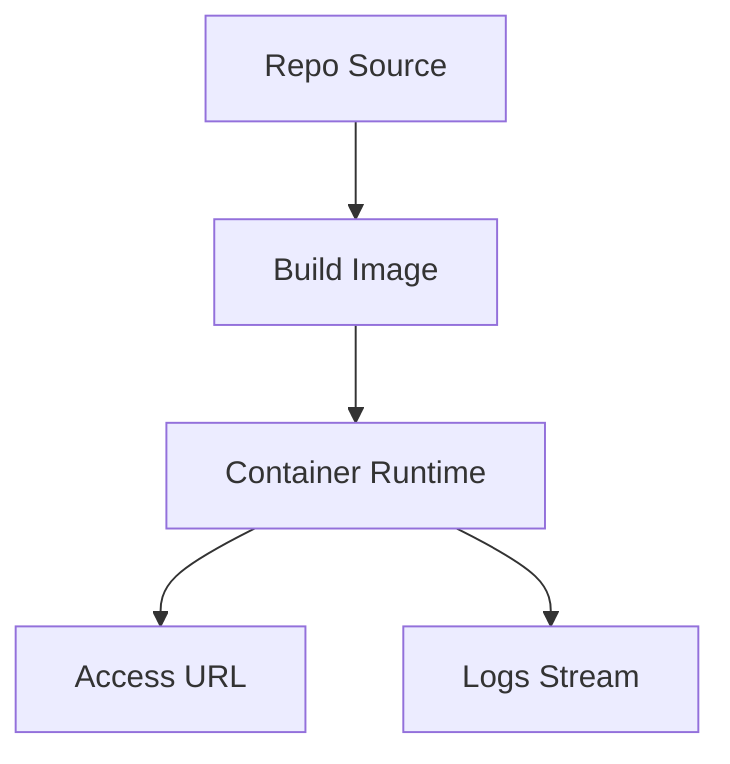

# Phase 4 智能展厅 + 体验打磨·配置升级验收报告

## 1. 概述 / 范围 / 结论
- 范围：在 Phase 3 Dashboard + 运维动作 + 日志导出基础上，新增“说明书自动生成 + Mermaid + 前端展示”，补齐错误码字典、healthz、配置体系与模板、端口池锁、超时控制与日志脱敏。
- 结论：**PASS**（后端与核心能力完成；前端依赖已在 WSL 内安装成功，启动步骤见第 11 节）。

## 2. 新增能力清单（Phase 4）
- 智能展厅：支持每个 case 生成说明书 Markdown（含 Mermaid 图），支持状态查询与手动重新生成。
- Dashboard：新增说明书状态列、模板创建入口、管理动作与分页筛选。
- 详情页：Tab 化（Overview / Logs / Manual），Manual 支持 Markdown + Mermaid 渲染。
- 体验打磨：错误统一 toast（带详情展开）、日志搜索/过滤/跳到最新/自动重连。
- 后端稳定性：healthz、错误码字典、日志敏感信息脱敏、端口池锁优化。
- 配置体系：`config.yaml` + 环境变量覆盖，新增 Case Template 方案。

## 3. Manual 模板与信号来源说明
- README：优先 `README.md/README.MD/README`，截取前 1200 字摘要。
- Tree：默认深度 2，过滤 `.git/node_modules/venv/dist/build` 等目录。
- 配置文件：识别 `.env(.example)`、`*.yaml/yml/toml/json`、`docker-compose.yml`、`pyproject.toml`、`package.json`、`requirements.txt`。
- Dockerfile：解析 base image、EXPOSE、CMD/ENTRYPOINT；无 Dockerfile 则在说明书提示。
- 降级策略：README 缺失时仍输出最小可用说明书（signals.has_readme = false）。

## 4. Manual API 契约（OpenAPI 可见）
- `POST /cases/{id}/manual`：触发生成，返回状态。
- `GET /cases/{id}/manual/status`：查询状态（PENDING/RUNNING/SUCCESS/FAILED）。
- `GET /cases/{id}/manual`：获取说明书 Markdown + meta。
- 管理接口：`GET /cases`、`POST /cases/{id}/stop|restart|retry|archive`、`GET /cases/{id}/logs`。
- 相关管理 API：`GET /case-templates`、`GET /error-codes`、`GET /stats`、`GET /healthz`。

示例：
```json
// POST /cases/{id}/manual
{"case_id":"c_ddec58","status":"PENDING"}
```
```json
// GET /cases/{id}/manual
{
  "case_id":"c_ddec58",
  "manual_markdown":"# ...",
  "meta":{
    "generated_at":1769096734.13,
    "generator_version":"v0.4",
    "signals":{"has_readme":true,"has_dockerfile":true,"tree_depth":2,"file_count":3},
    "time_cost_ms":12
  }
}
```

## 5. Mermaid 示例（来自说明书）


## 6. UX 打磨项
- 全局错误提示：统一 toast + 详情展开。
- 日志体验：关键词搜索 + stream 过滤 + 自动滚动/暂停 + “跳到最新” + 断线自动重连（指数退避）。
- 危险操作：Stop/Retry/Archive/Regenerate 二次确认 + 操作反馈。
- 空态/加载态：Manual 未生成、日志为空、请求失败均有提示。

## 7. 配置体系说明（config.yaml + env 覆盖）
- 新增 `config.yaml`：支持 dev/prod 配置，支持 `APP_ENV` / `CONFIG_PATH` 覆盖。
- Case Template：`name/repo_url/ref/default_env_keys/build_mode/port_mode/timeouts`。
- 说明书生成配置：`manual_root/manual_tree_depth/manual_max_readme_chars`。

## 8. 端口池 / 状态机 / 错误码字典
- 状态机：PENDING/CLONING/BUILDING/STARTING/RUNNING/FAILED/STOPPED/FINISHED/ARCHIVED（归档为软删除，不影响运行状态）。
- 端口池：Redis 端口锁，容器退出或 stop 时释放，防止并发冲突。
- 错误码字典：`/error-codes` 提供 message + hint（如 TIMEOUT_*、PORT_*、DOCKER_*）。

## 9. 测试证据（6 项 + 2 仓库 E2E）
1) 说明书生成（README 正常）：
- case：`c_ddec58`
- 证据：`.devlogs/phase4_case3_manual.json`

2) 说明书降级（README 缺失）：
- case：`c_d8cd8e`
- 证据：`.devlogs/phase4_fail_manual.json`（signals.has_readme=false）

3) Regenerate 更新：
- case：`c_ddec58`
- 证据：`.devlogs/phase4_case3_manual_regen.json`

4) 安全脱敏（日志中 *_KEY/*TOKEN/*SECRET）：
- case：`c_ddec58`
- 证据：`.devlogs/phase4_case3_logs_scrub.jsonl`（value 已替换为 ***）

5) /healthz 正常与 Redis Down：
- 证据：`.devlogs/phase4_healthz_ok.json`、`.devlogs/phase4_healthz_redis_down.json`

6) 端口池并发（3 个 case 同时启动）：
- 证据：`.devlogs/phase4_port_pool_status2.json`（30000/30001/30002）

E2E 用例 1（hello-world RUNNING）：
- case：`c_ddec58`
- 状态：`.devlogs/phase4_case3_status.json`
- 日志：`.devlogs/phase4_case3_logs.jsonl`
- 访问：`http://localhost:30000` -> 200

E2E 用例 2（metagpt-min RUNNING）：
- case：`c_2c1376`
- 状态：`.devlogs/phase4_case_metagpt_status.json`
- 日志：`.devlogs/phase4_case_metagpt_logs.jsonl`
- 访问：`http://localhost:30003` -> 200

失败/重试/归档链路：
- case：`c_d8cd8e`
- 失败：`.devlogs/phase4_fail_status.json`
- Retry：`.devlogs/phase4_fail_retry.json`、`.devlogs/phase4_fail_status_after_retry.json`
- Archive：`.devlogs/phase4_fail_archive.json` + 列表对比（`.devlogs/phase4_list_no_archived2.json` / `.devlogs/phase4_list_include_archived2.json`）

## 10. 演示脚本（5 分钟）
1) 进入 Dashboard，刷新列表与筛选状态。
2) 进入 Create 页面，选择模板 / 填写 repo，创建 case。
3) 列表中出现新 case，进入详情页查看状态与 access_url。
4) 打开 Logs 页，演示搜索/过滤/自动重连。
5) 切换 Manual 页，展示说明书与 Mermaid。
6) 点击 Stop -> Restart，查看状态变化。
7) 触发 Retry（失败 case）并查看错误码。
8) 导出日志 JSONL。
9) Archive 隐藏 case，include_archived 再查看。

## 11. 启动说明
- 后端：`./dev.sh up`
- 前端：`cd frontend && npm install && npm run dev`
- 配置：`config.yaml`（可用 `APP_ENV` / `CONFIG_PATH` 覆盖）

## 12. 问题清单与修复记录（含 patch）
- 已修复：说明书生成、配置体系、错误码字典、healthz、端口锁与日志脱敏。
- 已修复：前端依赖安装 UNC 路径问题（WSL 内使用 Node 18 后安装成功）。
- 当前阻塞：无。

Patch：`phase4.patch`
- 应用：`patch -p0 < phase4.patch`
- 回滚：`patch -R -p0 < phase4.patch`

## 13. 对接/沟通清单 + SLA
对接清单（需甲方确认）：
- 镜像源/镜像仓库（私有仓库账号与白名单）
- 资源配额（CPU/Mem/GPU、磁盘、并发限制）
- 网络策略（出站限制、域名白名单、端口范围）
- 运行域名与 HTTPS 证书
- 日志与监控平台接入方式

响应机制（建议 SLA）：
- P0（全站不可用）：1 小时内响应、4 小时内恢复
- P1（核心功能不可用）：4 小时内响应、24 小时内恢复
- P2（局部/边缘问题）：1 个工作日内响应

## 14. Phase 5 建议
1) 生产化部署（镜像化、多环境配置、CI/CD）
2) 说明书模板可编辑与版本对比
3) 更完善的权限与审计
4) 扩展观测指标（Prometheus/Grafana）
5) 产出完整交付包与运维手册
